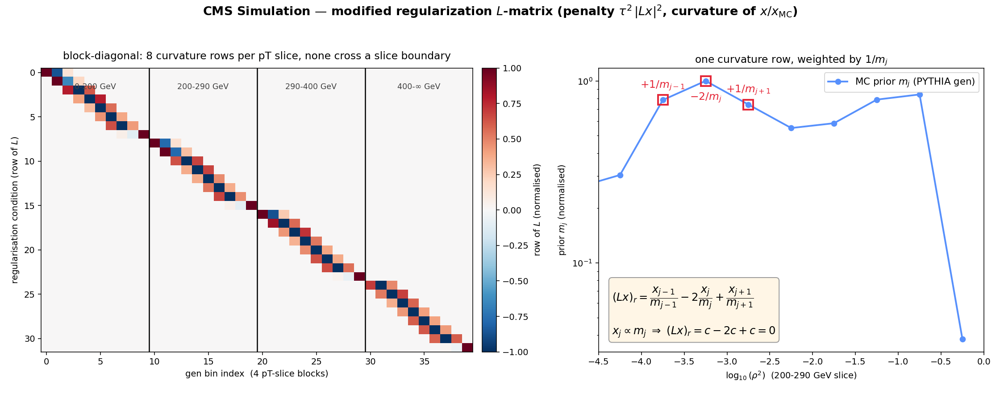

# Ratio-Curvature Regularization (the modified L-matrix)

How the Z+jet rho unfolding regularizes, why the standard TUnfold curvature
penalty is replaced by a **curvature-of-`x/x_MC`** penalty, and exactly how the
regularization matrix `L` is built.

Implementation: [`Unfolder._add_ratio_curvature_conditions`](../src/unfold/tools/unfolder_core.py)
(`regularization="ratio_curvature"`). Figure produced by
[`scripts/make_lmatrix_figure.py`](../scripts/make_lmatrix_figure.py).



## 1. What regularization does

TUnfold minimizes

```
chi2(x) = (y - A x)^T V_y^{-1} (y - A x)  +  tau^2 |L x|^2
```

where `A` is the response, `y` the measured data, `x` the unfolded truth, and
the second term is the regularization: `tau` sets its strength and `L` defines
*what* is penalized. At `tau = 0` (the long-standing default) the second term
vanishes and the fit is a pure generalized least squares. Turning regularization
on suppresses the statistical noise that the inversion amplifies in the low-rho
tail — but only if `L` penalizes the right thing.

## 2. Why not the standard curvature penalty

TUnfold's built-in curvature option (`kRegModeCurvature`) uses rows

```
L_row = ( ... 0,  1,  -2,  1,  0 ... )     ->   (Lx)_r = x_{j-1} - 2 x_j + x_{j+1}
```

i.e. the **discrete second derivative of `x` itself**. This pushes `x` toward a
straight line. But the physical rho spectrum (and the MC prior) is steeply
falling and curved, so the standard penalty fights the true shape: it biases the
result toward flat and **breaks self-closure** (unfolding the MC's own reco no
longer returns the MC truth — up to ~8% in this binning).

## 3. The modification: curvature of `x / x_MC`

We replace each curvature row by the same stencil **divided by the MC prior**
`m = x_MC` (nominal PYTHIA gen) bin-by-bin:

```
L_row = ( ... 0,  1/m_{j-1},  -2/m_j,  1/m_{j+1},  0 ... )
```

so that

```
(Lx)_r = x_{j-1}/m_{j-1} - 2 x_j/m_j + x_{j+1}/m_{j+1}
       = discrete curvature of the ratio  r_j = x_j / m_j .
```

**Key property — zero penalty for any spectrum proportional to the prior.**
If `x_j = c * m_j` then `r_j = c` is constant and

```
(Lx)_r = c - 2c + c = 0 .
```

So the steeply falling MC shape (and the nominal MC itself) carries *exactly
zero* penalty; only **deviations of the data/MC ratio shape** from the prior are
smoothed. This is why self-closure stays exact at any `tau`. In matrix form
`L = D_curv · M^{-1}` with `M = diag(m)` — the standard curvature operator with
each column rescaled by `1/m_j` (right panel of the figure).

## 4. How `L` is built (code)

```python
# Unfolder._add_ratio_curvature_conditions(unfold, prior_flat)
offset = 0
for edges in self.gen_edges_by_pt:           # one block per pT slice
    nbins = len(edges) - 1
    for k in range(1, nbins - 1):            # interior gen bins only
        j0, j1, j2 = offset+k-1, offset+k, offset+k+1
        m0, m1, m2 = prior_flat[[j0, j1, j2]]
        if min(m0, m1, m2) <= 0:             # skip empty-prior triples
            continue
        unfold.AddRegularisationCondition(j0+1, 1/m0, j1+1, -2/m1, j2+1, 1/m2)
    offset += nbins
```

Consequences, visible in the left panel of the figure:

- **Block-diagonal.** The loop resets `offset` per pT slice, so **no condition
  crosses a pT-slice boundary** — each slice is regularized independently (4
  blocks, 8 interior rows each → a 32×40 `L` for the groomed binning).
- **The prior is frozen.** `prior_flat` is the *nominal* MC truth for every
  systematic and jackknife re-unfold — the regularization is part of the
  measurement definition and must not move with the response.
- Built via the `TUnfoldDensityOpenL` shim (`kRegModeNone` + the public
  `AddRegularisationCondition`), because the exact `1/m`-weighted row cannot be
  expressed through `RegularizeCurvature`.

## 5. Choosing `tau`

`tau` is fixed by an **L-curve scan on the nominal data unfold** and then frozen
for all systematic and jackknife re-unfolds. Groomed: `tau ≈ 4.4`; ungroomed:
`tau ≈ 0.08` (≈ no regularization — the L-curve says ungroomed does not need it).
A ScanSURE cross-check brackets the groomed choice within ~×2
(`tau ≈ 1.9`). The scan curve is saved to `unfold/lcurve_<mode>.pdf`.

## 6. Validation (why it is safe to turn on)

| test | result at the L-curve `tau` (groomed) | script |
|---|---|---|
| self-closure (unfold MC reco → MC gen) | **exact, 0%** at any `tau` | `study_regularization_rho.py` |
| HERWIG model bias | **unchanged** vs `tau=0` (<0.1% added) | `study_regularization_rho.py` |
| 50-50 independent PYTHIA closure | **<1.3% median, within the half-sample stat band** (better than `tau=0`) | `study_5050_bias.py` |
| input-stat error on unfolded bins | **≈halved**; low-rho tail 15–23% → 4–5% | `study_error_vs_tau.py` |
| bottom-line test | still passes (`chi2_unfold` rises ~0.3%, stays ≤ `chi2_smeared`) | `study_bottom_line_chi2.py` |

The 50-50 test (independent half-samples reconstructed from the delete-one-tenth
jackknife mosaics, `tenth_i = full - jk_i`) is the decisive one: it shows the
regularization recovers a statistically independent truth within errors and adds
no bias — it suppresses noise rather than pulling the data toward the prior.

## 7. Production

The regularized result is the `original_jacobian_reg` tag, which combines
`regularization="ratio_curvature"` with `stat_propagation="jacobian"` so the
reported statistical uncertainty is the **TUnfold-propagated (EMatrix)**
covariance through the normalization (not the diagonal, under-scaled jackknife):

```bash
python scripts/run_unfolding.py --channel zjet --observable rho --tag original_jacobian_reg
# -> outputs/zjet/rho/original_jacobian_reg/  (+ unfold/normalized_covariance_*.npz, lcurve_*.pdf)
```

See also [Unfolder_core_class_reference.md](Unfolder_core_class_reference.md).
