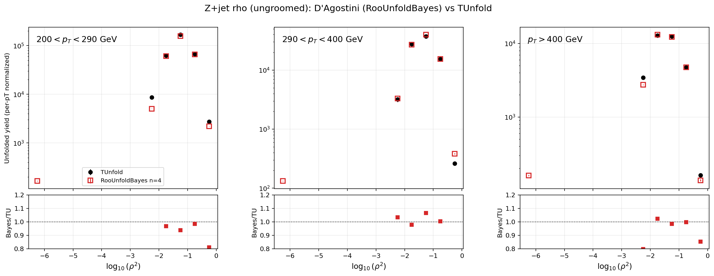
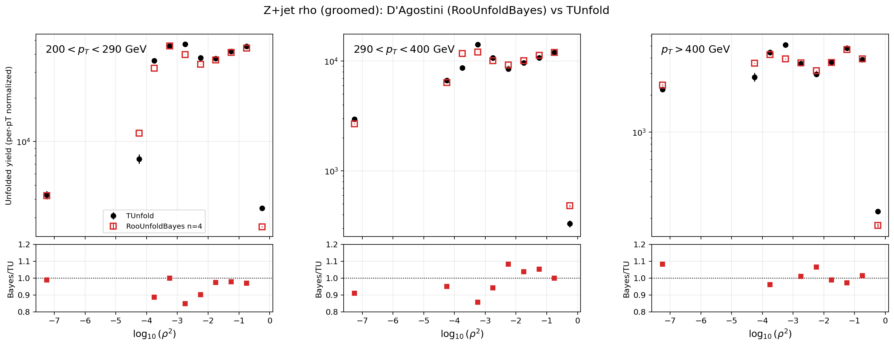

# D'Agostini (RooUnfoldBayes) vs TUnfold — z+jet ρ (proof of concept)

Proof of concept for the CMS-recommended **iterative Bayes (D'Agostini)**
pathway via **RooUnfold**, run on the *same* prepared inputs as the production
TUnfold path and using the *same jackknife* for the statistical uncertainty.

## How it works
`scripts/study_roounfold_bayes.py` builds the zjet rho `Unfolder` (which prepares
the response, the fake-corrected measured data, the misses, and the 10+10
jackknife replicas, and runs the nominal TUnfold unfold + jackknife). It then
re-unfolds the **same** inputs and the **same** replicas through
`RooUnfoldBayes(n_iter)` (`src/unfold/tools/roounfold_backend.py`).

The response/efficiency/fakes mapping onto `RooUnfoldResponse(hMeas, hTruth, hResp)`:
`hResp[r,t]=response[r,t]`, `hTruth[t]=response.sum(reco)[t]+misses` (sets the
efficiency and the prior), `hMeas[r]=response.sum(truth)[r]` (fakes=0, since the
data is fed already fake-corrected). The jackknife stat uncertainty is the
`sqrt(10/9)`-scaled spread of the input-varied and matrix-varied re-unfolds,
combined in quadrature — identical definition to the TUnfold path.

```bash
source scripts/setup_root.sh
source scripts/setup_roounfold.sh      # needs a built libRooUnfold
python scripts/study_roounfold_bayes.py --tag original --n-iter 4
```

## Result

**ungroomed**



**groomed**



## Interpretation
- **The pathway works.** RooUnfoldBayes runs on the production inputs and the
  jackknife flows through unchanged — D'Agostini with a jackknife statistical
  uncertainty is doable and demonstrated.
- **In the populated bulk** (−4.5 ≲ log₁₀ρ² ≲ 0) the two methods agree at the
  **5–10%** level (ratio panel hovers around 1.0). This bulk agreement validates
  the efficiency/fakes/prior mapping — a wrong mapping would show a systematic
  offset, not scatter around unity.
- **Divergence is confined to the sparse edge bins** — the merged low-ρ
  underflow bin and the high-ρ edge bin (tiny absolute yields). There the
  unregularized TUnfold (`DoUnfold(0)`) oscillates while Bayes stays near its
  prior; the two genuinely differ. These few bins dominate the *unweighted* mean
  ratio (ungroomed 0.36, groomed 0.13) but are negligible by yield.
- **Bayes jackknife uncertainty is ~5× smaller** (median ≈0.005 vs TUnfold
  ≈0.023). Expected: `n_iter=4` is a regularization that anchors to the prior and
  suppresses statistical fluctuations (a bias/variance trade). Increasing
  `n_iter` relaxes this toward the unregularized TUnfold variance.

## Status
This script is the validation cross-check. RooUnfoldBayes is now also a
**first-class backend**: `ObservableSpec.method = "roounfold_bayes"` (with
`n_iter`) routes the whole `Unfolder` pipeline through D'Agostini, so

```bash
python scripts/run_unfolding.py --channel zjet --observable rho --method roounfold_bayes --n-iter 4
# -> outputs/zjet/rho/original_bayes/
```

produces the full output suite (systematics, normalized covariances, 2D
summaries, all plots) through Bayes, with the jackknife statistical uncertainty.
Open: choosing `n_iter` (scan vs the current fixed 4).
