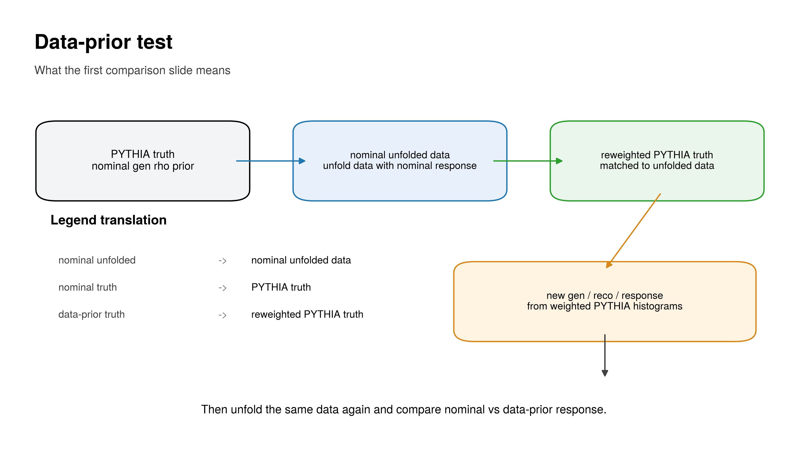
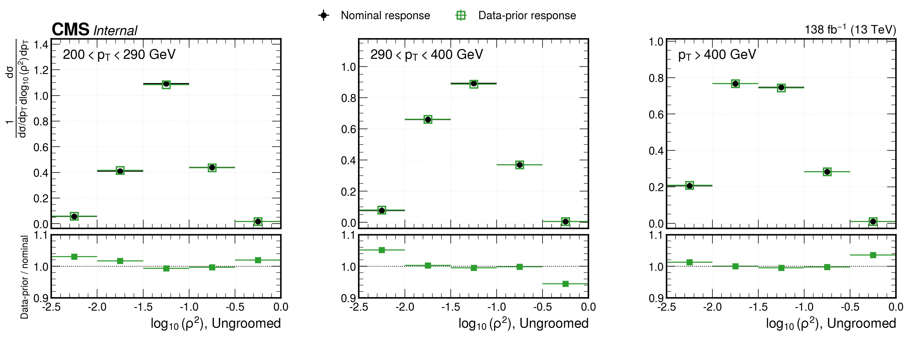
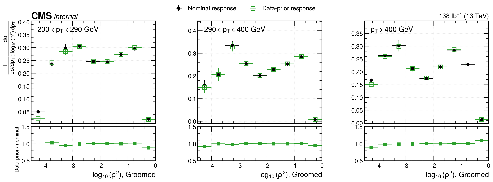

# Data-prior response test — z+jet ρ

## Motivation
The nominal unfolding is run **unregularized** (TUnfold `DoUnfold(0.0)`), so there
is no explicit regularization/prior bias. What remains is the dependence on the
MC **gen-level prior** baked into the response matrix. This test bounds that
dependence directly: build a second response from a PYTHIA sample whose
**gen-level ρ prior has been reweighted toward the unfolded data**, unfold the
same data through it, and compare. If the published (per-pT normalized) result
barely moves even when the prior is pulled hard toward the data, the result is
prior-independent.

## Method
1. Unfold data with the **nominal** PYTHIA response.
2. Take a producer pickle whose gen-level ρ prior is reweighted toward the
   unfolded data (a full re-histogrammed sample — gen, reco, and response — not
   an event-level correction). Pass it with `--weighted-mc`.
3. Unfold the **same data** through this **data-prior** response.
4. Compare priors, response matrices, reco closure, and the unfolded result,
   per grooming mode.

```bash
source scripts/setup_root.sh
python scripts/study_data_prior.py --weighted-mc /path/to/weighted_pythia_all.pkl --tag original
# redraw the clean comparison figures later, no ROOT / heavy pickle needed:
python scripts/plot_data_prior_unfolded_comparison.py
```

The weighted pickle is a one-off research input and is **not committed**. The
small per-mode `artifacts/{mode}_data_prior_test.npz` files **are** committed so
`plot_data_prior_unfolded_comparison.py` can regenerate the comparison figures
without re-running the unfold.

## What the test does



## Results
Shifts are `|ratio − 1|` between the data-prior and nominal unfolds. The
**prior shift** shows how hard the gen prior was pulled; the **2D-normalized**
and **per-pT visible shape** shifts are the published-quantity stability.

| mode | prior shift (mean / max) | 2D-normalized shift (mean / max) | per-pT visible shape shift (mean range) |
|---|---|---|---|
| ungroomed | 0.196 / 0.705 | 0.031 / 0.107 | 0.011 – 0.023 |
| groomed   | 0.268 / 1.328 | 0.111 / 1.471 | 0.019 – 0.085 |

Per-pT visible normalized shape shift (mean `|ratio−1|` over the visible ρ range):

| pT bin (GeV) | ungroomed | groomed |
|---|---|---|
| 0–200   | 0.020 | 0.050 |
| 200–290 | 0.015 | 0.085 |
| 290–400 | 0.023 | 0.019 |
| 400–∞   | 0.011 | 0.027 |

No negative fake or miss bins in either response.

### Clean comparison (analysis-note figure)
Nominal-response vs data-prior-response unfolded data, per-pT normalized, with a
data-prior/nominal ratio panel (0–200 GeV sink bin and merged low-ρ underflow
bin dropped).

**ungroomed**



**groomed**



### Full per-mode slides
Gen level, reco-level closure, response matrix, and unfolded result are written
as `{mode}_{gen_level,reco_level,response_matrix,unfolded}_comparison.png`
(and `.pdf`), collected in `data_prior_comparison_slides.pdf`.

## Interpretation
- **Ungroomed**: the gen prior is moved ~20% (mean), yet the per-pT normalized
  result shifts only ~1–2% — the published spectrum is essentially
  prior-independent.
- **Groomed**: the prior is moved ~27%; the normalized result is stable to a few
  percent in the well-populated bins. The large `max` excursions sit in the
  sparse low-ρ / low-statistics bins (notably 200–290 GeV) and are not
  representative of the visible spectrum.

## Bottom line
Pulling the response's gen prior hard toward the data leaves the per-pT
normalized unfolded result nearly unchanged, confirming the unregularized
unfolding is **not prior driven**. This is a robustness cross-check, not a
correction to apply. Provenance (input hashes, command, ROOT version, full
per-bin shifts) is recorded in `run_manifest.json` and `run_summary.txt`.
