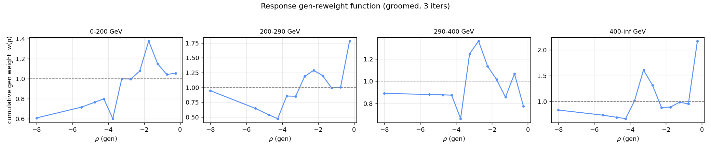
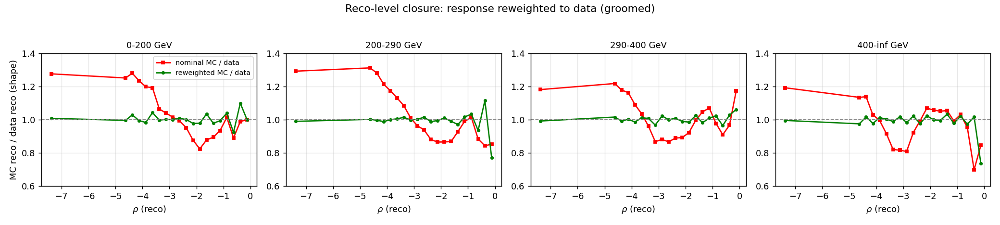
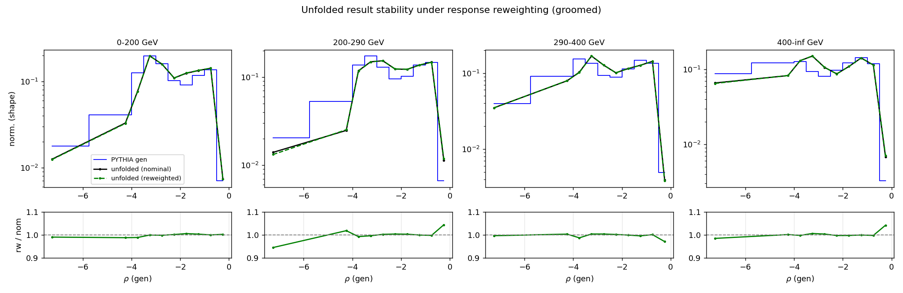
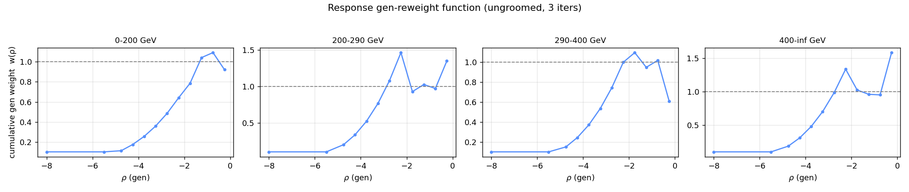
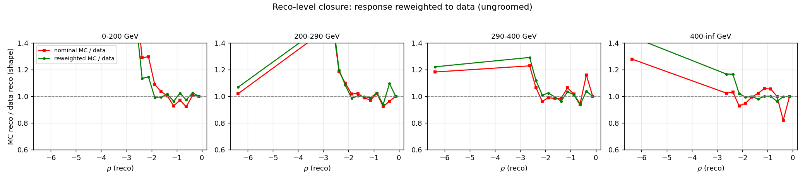
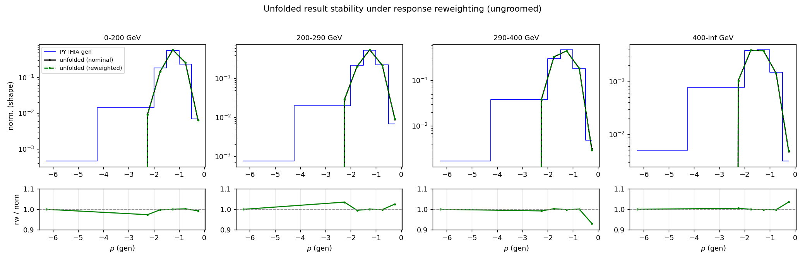

# Response reweighting (reweight-to-data) study — z+jet ρ
## Motivation
The nominal unfolding is run **unregularized** (TUnfold `DoUnfold(0.0)`), so it carries **no regularization/prior bias**. What remains is *model dependence* from the MC used to build the response: the **within-bin migration shape**, the **efficiency/acceptance**, and the **fake** subtraction. This study reduces that dependence by reweighting the MC so its gen shape matches the unfolded data, rebuilding the response, and re-unfolding.
## Method
1. Unfold data with the nominal PYTHIA response → `x⁰`.
2. Form the gen ratio `r(ρ) = unfolded / MC-truth` per gen bin and interpolate it onto the **fine** gen axis (finer than the unfolding bins) — a flat per-analysis-bin weight is a no-op at τ=0, so the *within-bin* gradient is what matters.
3. Reweight the fine response along the gen axis, rebuild the response matrix, misses/efficiency, and fake fraction, and re-unfold.
4. Iterate (3×) — multiplicative update of the cumulative weight. The response matrix is rebuilt each step (this is *not* canonical IBU, which keeps the smearing matrix fixed).

> **Granularity caveat.** The fine gen axis has only 12 bins vs the 10 (groomed) / 6 (ungroomed) analysis bins, so within-bin freedom lives mainly in the lowest-ρ (merged) bin. The reweighting effect is therefore expected to be modest and localized — which is itself the result: it bounds the within-bin model dependence.

## Results
| mode | reco shape mismatch (nominal) | reco shape mismatch (reweighted) | mean unfolded shift |
|---|---|---|---|
| groomed | 0.112 | 0.025 | 0.0083 |
| ungroomed | 0.119 | 0.107 | 0.0097 |

Reco shape mismatch = mean over bins of `|MC_reco/data_reco − 1|` (lower = better closure); unfolded shift = mean `|reweighted/nominal − 1|` of the unfolded result (small = robust).

### groomed
Per-iteration max |data/MC − 1| (gen): 1.095, 0.228, 0.128

**Gen reweight function**

**Reco-level closure (MC vs data, before/after)**

**Unfolded stability (nominal vs reweighted)**

### ungroomed
Per-iteration max |data/MC − 1| (gen): 0.750, 0.750, 0.750

**Gen reweight function**

**Reco-level closure (MC vs data, before/after)**

**Unfolded stability (nominal vs reweighted)**

## Interpretation
- If **reco closure improves** (green closer to 1 than red) while the **unfolded result barely moves**, the unregularized result is robust against within-bin model dependence — the reweighting confirms low bias.
- A large unfolded shift would instead flag genuine model dependence to assign as a systematic.
- **Groomed**: reco closure improves sharply (≈0.11→0.03) while the unfolded result moves <1% — robust.
- **Ungroomed**: closure improves in the populated region but **overshoots in the sparse low-ρ tail** (coarser 6-bin gen axis + few events), so the gain is limited; the unfolded result is still stable (<1%).
- Natural next step: rerun the HERWIG non-closure (bias) test with the reweighted response and check the ~20% model-uncertainty source shrinks.
